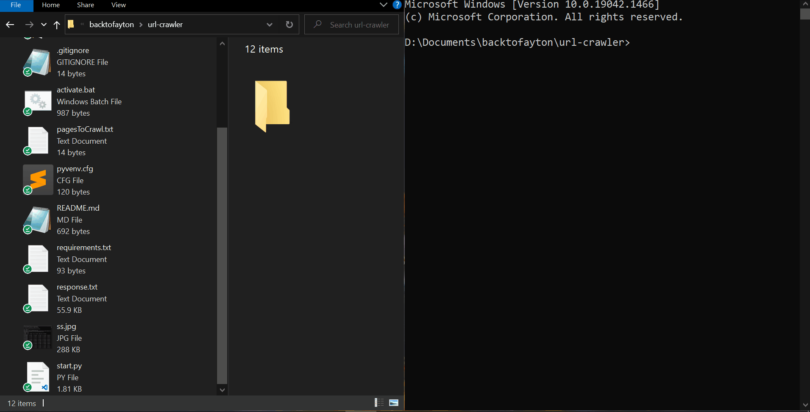
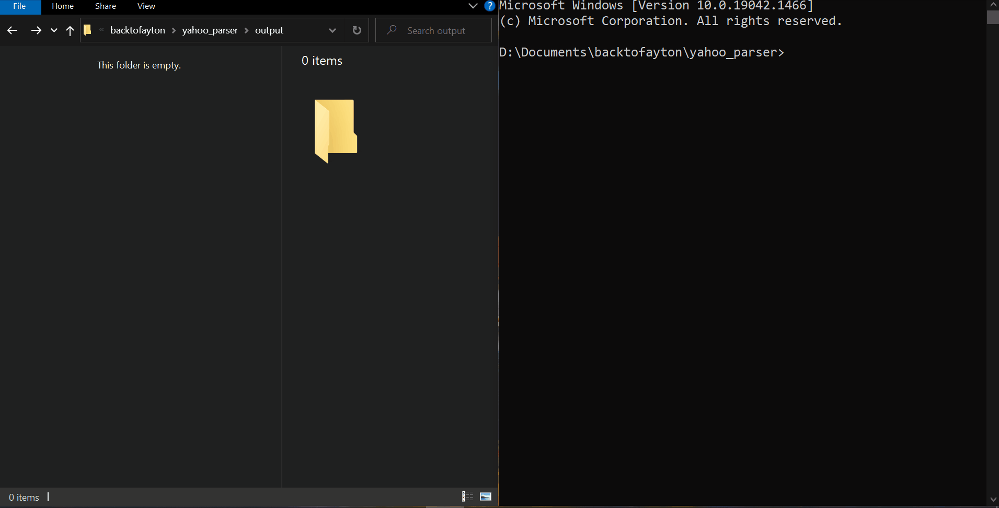
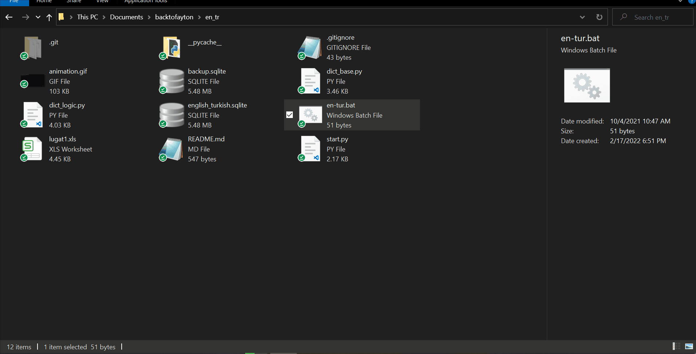

## URL crawler
Parse the links from given set if URLs.

> Built With
- Python

## Financial data parser from Yahoo
Retrieve historical data of a given ticker list for a given time period from finance.yahoo.com

[Source code](https://github.com/damdafayton/yahoo_parser)

> Built With
- Python

## English to Turkish CLI Dictionary

[Source code](https://github.com/damdafayton/eng-tur-dictionary)

> Built With
- Python

## RTF to PDF Converter
[Source code](https://github.com/damdafayton/rtfToPdf)

> Built With
- Python

## Various Algorithms
[Source code](https://github.com/damdafayton/algorithms)

> Built With
- Python, JavaScript